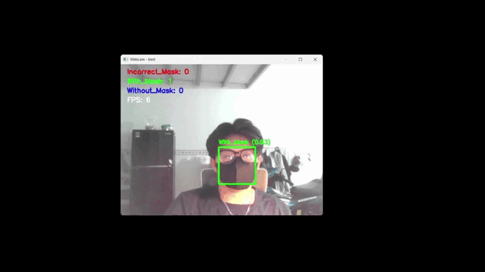
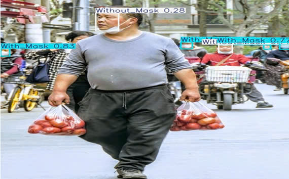
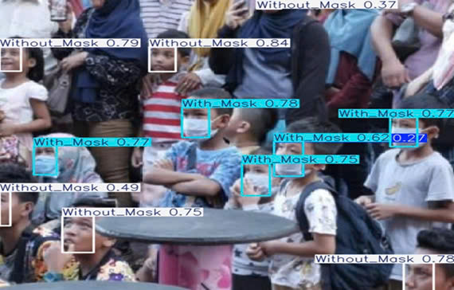

# Face Mask Detection Using YOLOv10s
## 📌 Project Overview
This project focuses on detecting the status of face mask usage in real-time using the YOLOv10s model. The system classifies individuals into three categories:

* With Mask – Properly wearing a face mask.

* Without Mask – No face mask detected.

* Mask Worn Incorrectly – The mask is not worn correctly (e.g., below the nose).

## 🔍 Introduction
### Input:
* Live Video Stream (via webcam)

* Image Files (JPG, PNG, etc.)

* Video Files (MP4, AVI, etc.)
### Output:
* Annotated Video Stream (with bounding boxes and labels: "With Mask", "Without Mask", "Incorrect Mask")

* Detection Confidence Score

* Processed images/videos with bounding boxes
## ⏱️ Predict in real time
This video uses a laptop webcam to predict whether a person is wearing a mas

## 📸 Predict in images
The predicted image will display the corresponding prediction results. Users just need to upload the image, and the model will classify the mask-wearing status of the person in the image (correct, incorrect, or no mask).

## 🚀 Installation & Setup
### Clone the Repository
    git clone https://github.com/danghohai2004/FaceMaskDetection-YOLOv10s.git
    cd FaceMaskDetection-YOLOv10s
### Install Dependencies
    pip install -r requirements.txt
### Run Mask Detection code in real time
    python mask_detection.py
# Thank you for watching 🙏😊
